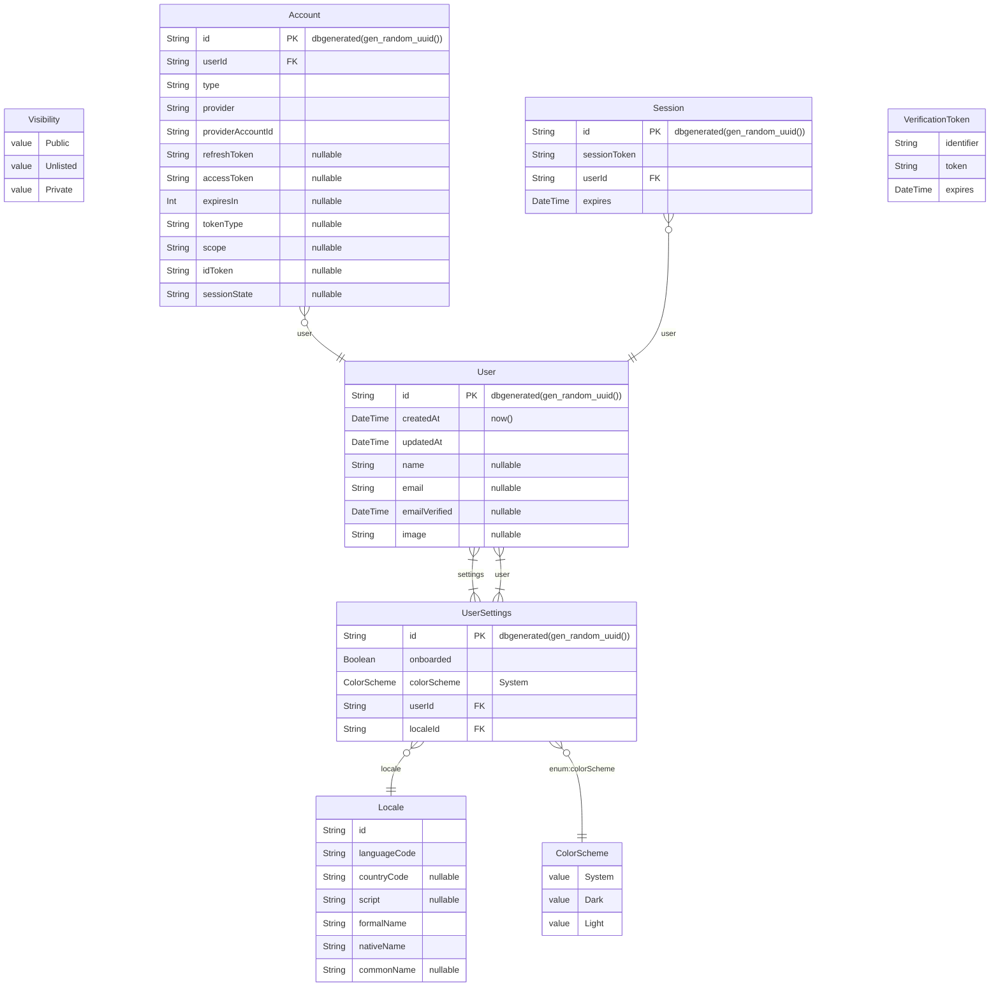

```mermaid
erDiagram
	ColorScheme {
		value System
		value Dark
		value Light
	}
	Visibility {
		value Public
		value Unlisted
		value Private
	}
	User {
		String id PK  "dbgenerated(gen_random_uuid())"
		DateTime createdAt  "now()"
		DateTime updatedAt
		String name  "nullable"
		String email  "nullable"
		DateTime emailVerified  "nullable"
		String image  "nullable"
	}
	UserSettings {
		String id PK  "dbgenerated(gen_random_uuid())"
		Boolean onboarded
		ColorScheme colorScheme "System"
		String userId FK
		String localeId FK
	}
	Locale {
		String id
		String languageCode
		String countryCode  "nullable"
		String script  "nullable"
		String formalName
		String nativeName
		String commonName  "nullable"
	}
	Account {
		String id PK  "dbgenerated(gen_random_uuid())"
		String userId FK
		String type
		String provider
		String providerAccountId
		String refreshToken  "nullable"
		String accessToken  "nullable"
		Int expiresIn  "nullable"
		String tokenType  "nullable"
		String scope  "nullable"
		String idToken  "nullable"
		String sessionState  "nullable"
	}
	Session {
		String id PK  "dbgenerated(gen_random_uuid())"
		String sessionToken
		String userId FK
		DateTime expires
	}
	VerificationToken {
		String identifier
		String token
		DateTime expires
	}
	User }|--|{ UserSettings : settings
	UserSettings }|--|{ User : user
	UserSettings }o--|| Locale : locale
	UserSettings }o--|| ColorScheme : "enum:colorScheme"
	Account }o--|| User : user
	Session }o--|| User : user

```
